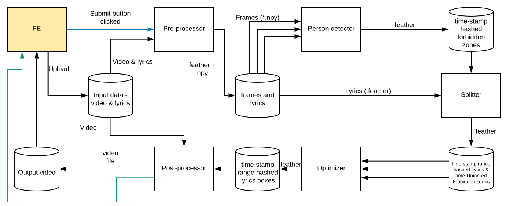

# lyrics_overlay

## What?

This project aims to put lyrics for a particular frame of a video in an optimal location avoiding
overlap with the main subjects of the video.

Assumptions:
1. In this case "subjects" are "persons".
2. Number of subjects = 1
3. Maximum time-length = 5 minutes
4. Maximum frames per second = 60
5. Maximum resolution = 1920x1080 (FHD)
5. No time-overlapping lyrics

## Architecture

## How to run?

### Pre-requisites
1. Since its a Python project - one needs to have Python v3.8+.
1. Clone the repo.
2. Make and activate a virtual environment either from your IDE or by following the instructions [here](https://docs.python.org/3/tutorial/venv.html).
3. Install all the `pip` dependencies by running - `pip3 install -r requirements.txt`.

#### For Mac users
The `torch` and `torchvision` can be installed by running `pip3 install torch torchvision`.

### Running the application

Run this command inside your virtual environment - `python3 main.py`

## For developing

This repo is auto-linted using `pre-commit`. So before you push any commits
please install it following the instructions in their official website [here](https://pre-commit.com/#installation).
